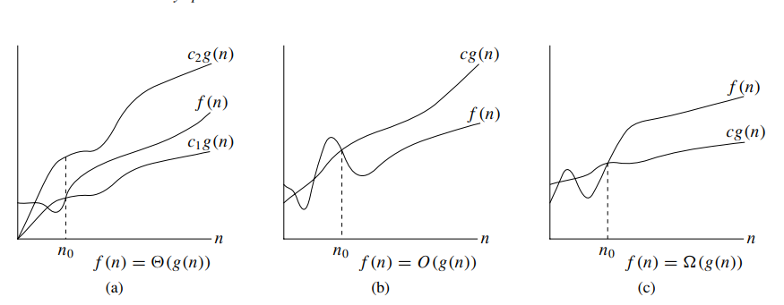

# Asymptotic notation:

The notations we use to describe the asymptotic running time of an algorithm
are defined in terms of functions whose domains are the set of natural numbers
N = {0, 1, 2,...}. Such notations are convenient for describing the worst-case
running-time function T (n), which is usually defined only on integer input sizes.

It is sometimes convenient, however, to abuse asymptotic notation in a variety of ways. For example, the notation is easily extended to the domain of real numbers
or, alternatively, restricted to a subset of the natural numbers. **It is important**, however, to understand the precise meaning of the notation so that when it is abused, it
is not misused. This section defines the basic asymptotic notations and also introduces some common abuses.

## Theta notation

Theta notation (Θ) is used to describe the asymptotic behavior of an algorithm’s running time. It provides a way to define an upper and lower bound on the growth rate of a function, which can be used to describe the performance of an algorithm.

In the context of algorithm analysis, theta notation is often used to describe the worst-case running time of an algorithm. For example, if an algorithm has a worst-case running time of Θ(n^2), this means that the number of operations performed by the algorithm grows quadratically with the size of the input.

It’s important to note that theta notation only provides an asymptotic bound on the growth rate of a function. It does not provide any information about the actual running time of an algorithm for small inputs or about constant factors that may affect its performance.

 we found that the worst-case running time of insertion sort is
T (n) = (n2). Let us define what this notation means. For a given function g(n),
we denote by (g(n)) the set of function

$$
\Theta(g(n)) = f(n) \text{ if there exist positive constants } c_1, c_2, \text{ and } n_0 \text{ such that } 0 \leq c_1g(n) \leq f(n) \leq c_2g(n) \text{ for all } n \geq n_0.
$$

f (n) belongs to the set (g(n)) if there exist positive constants c1
and c2 such that it can be “sandwiched” between c1g(n) and c2g(n), for sufficiently large n. Because (g(n)) is a set, we could write “ f (n) E (g(n))”
to indicate that f (n) is a member of (g(n)). Instead, we will usually write
“ f (n) = (g(n))” to express the same notion.

## O-notation

Big O notation (O) is used to describe the asymptotic behavior of a function, and is often used in algorithm analysis to describe the worst-case or average-case running time. It provides an upper bound on the growth rate of a function, which can be used to describe the performance of an algorithm.

The o-notation asymptotically bounds a function from above and below. When
we have only an asymptotic upper bound, we use O-notation. For a given function g(n), we denote by O(g(n)) (pronounced “big-oh of g of n” or sometimes just
“oh of g of n”) the set of functions

We use O-notation to give an upper bound on a function, to within a constant
factor. Figure 3.1(b) shows the intuition behind O-notation. For all values n to the
right of n0, the value of the function f (n) is on or below g(n)

We write f (n) = O(g(n)) to indicate that a function f (n) is a member of
the set O(g(n)). Note that f (n) = (g(n)) implies f (n) = O(g(n)), since theta-
notation is a stronger notion than O-notation.

## Omega notation

Omega notation (Ω) is used to describe the asymptotic behavior of a function, and is often used in algorithm analysis to describe the best-case running time. It provides a lower bound on the growth rate of a function, which can be used to describe the performance of an algorithm.

In formal terms, a function f(n) is said to be Ω(g(n)) if there exist positive constants c and n0 such that 0 ≤ cg(n) ≤ f(n) for all n ≥ n0. This means that the function f(n) is bounded below by the function g(n) multiplied by a constant for sufficiently large values of n

$$
f(n) = \Omega(g(n)) \text{ if there exist positive constants } c \text{ and } n_0 \text{ such that } 0 \leq cg(n) \leq f(n) \text{ for all } n \geq n_0.
$$

